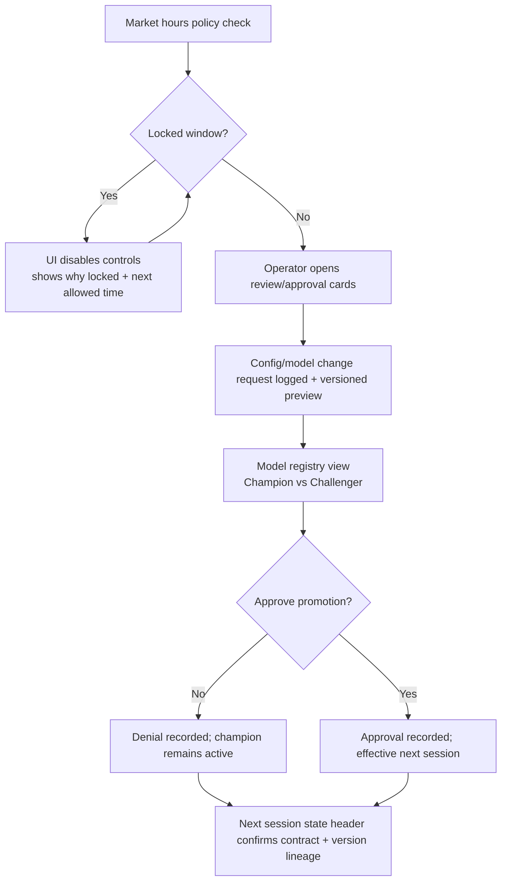
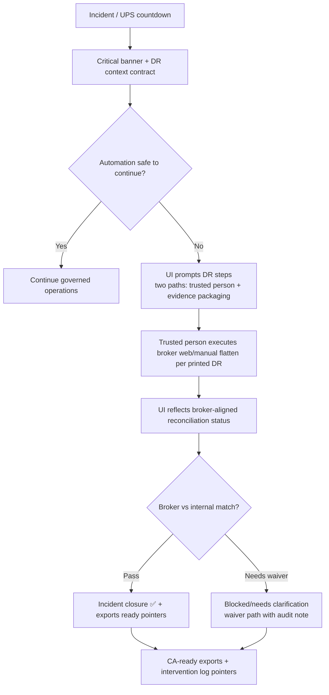
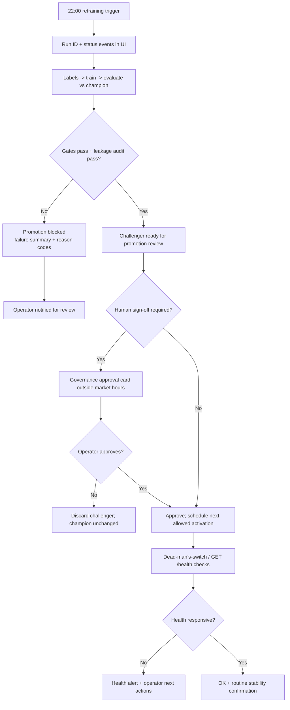

# UX Design Specification {{project_name}}

**Author:** {{user_name}}
**Date:** {{date}}

---

<!-- UX design content will be appended sequentially through collaborative workflow steps -->

## Executive Summary

### Project Vision
A trust-first intraday trading experience for a single technical operator: a governed, risk-gated system where decisions are transparent (“act vs block”) and degraded behavior is an explicit contract (not a guess). The operator should feel, in seconds, what the system knew, what risk allowed, what the broker did, and why it refused—so paper-to-live progression stays emotionally and operationally safe.

### Target Users
Primary: one solo technical operator (“builder-trader”) running a dedicated machine during market hours. Intermediate skill level; comfortable with local services/logs; needs clear operational status, decision reasons, and evidence (reconciliation, audit trails, model/rule lineage) more than exploratory analytics.

Secondary: “downstream consumers” of exports (e.g., CA/accounting workflows). They are not in-product decision-makers, so the product should produce export-ready artifacts with the same traceability guarantees.

### Key Design Challenges
1) Make the order/risk lifecycle legible: the UI must explain outcomes with stable reason codes and traceable evidence (input freshness -> data mode -> risk gate -> resulting order state).
2) Degraded-mode semantics must be unmistakable: when the system enters `REST_POLL` / monitor-only behavior, the operator must clearly understand that “entries are suppressed by policy” and what is still actively managed (stops/exits).
3) Reduce attention load during stress: the console must support fast “next action” comprehension (kill switch drill confirmation, reconciliation checklist prompts, governance lockouts) without requiring forensic browsing.
4) Operationalize reconciliation confidence: “Did broker match us?” becomes a checklist-style pass/fail with explicit next steps (block next-day live vs waived-with-audit-note).

### Design Opportunities
1) “Trust rituals” that compress complexity into predictable moments: morning brief overview + during-session state cards + end-of-day reconciliation close-out.
2) Act/Block decision cards that always show the same causal chain: freshness status, data source mode, feature/signal snapshot, risk gate verdict, then broker/order state.
3) Governance UX that feels protective, not bureaucratic: explicit lock/disabled controls during market hours, plus calm review/approve/deny flow outside market hours with clear audit context.
4) Explainability that’s purposeful: SHAP/top-features surfacing framed as sanity checks tied to sampled decisions, not an invitation to override the risk gateway.

## Core User Experience

### Defining Experience
The operator’s core loop is: **glance → understand trust state → decide whether to act**.
In practice, this means the UI continuously answers three questions without requiring the operator to interpret logs or guess semantics:
1) **Are we in a normal trading contract or a degraded/locked contract?**
2) **If the system is trading, what decisions did it make and why (act vs block)?**
3) **If something is off, what is the next safe action (ack, wait, reconcile, or execute the kill switch with confirmation)?**

This keeps the operator’s attention on governed outcomes rather than internal complexity.

### Platform Strategy
Provide a **local operator console** (desktop-browser experience via Streamlit) that is optimized for:
- **Fast comprehension** in under ~10 seconds during market hours
- **Single-screen readability** with clear modes, reason codes, and actionable next steps
- **Keyboard/mouse efficiency** for an intermediate technical operator
- **Progressive disclosure**: summary first, details on demand

Pair it with **Telegram notifications** for out-of-band “must-not-miss” events:
- mode changes (e.g., WebSocket vs `REST_POLL`)
- kill switch events and confirmations
- reconciliation failure summaries
- training/retraining status and failures
- dead-man’s-switch alerts

### Effortless Interactions
The UI should make these actions nearly automatic:
- **Default dashboards that stay honest**: prominent mode/state labels that directly reflect the system contract
- **Act/Block decision cards** that always show the same causal chain: freshness/data mode → feature/signal snapshot → risk verdict → broker/order outcome (or explicit suppression)
- **Reason codes with “what this means”**: each block/reject explanation should include an operator-facing interpretation and next step
- **One-click acknowledgements where safe** (e.g., acknowledging alerts) while keeping risk-increasing actions gated
- **Reconciliation readiness cues**: clear “pass/failed/needs waiver” signals so EOD is a routine checklist, not an investigation
- **Kill switch ergonomics**: visible only as “dangerous but present,” with a deliberate two-step confirmation flow

### Critical Success Moments
1) **Morning briefing (first glance success)**: the operator instantly understands watchlist readiness, mode status, and whether entries are allowed yet.
2) **Observation-only window (09:15–09:30)**: the UI must make “no new entries by policy” feel intentional and obvious.
3) **Degraded mode transition (WebSocket drop → `REST_POLL`)**: within moments, the operator understands what is still actively managed vs what is intentionally suppressed.
4) **Risk gate rejection moment**: the operator sees the stable reason and knows whether anything changes next time or today requires intervention.
5) **EOD reconciliation**: the operator gets a clear “reconciled” outcome or a blocked-next-day outcome with a constrained path to clear it.

### Experience Principles
- **Contract-first semantics**: the UI mirrors system truth (including suppression-by-policy), never approximate it.
- **Attention compression**: summaries and reason codes are designed for fast “next action” understanding.
- **Safety through constrained affordances**: dangerous actions require deliberate user confirmation and explicit audit context.
- **Traceability by default**: decision context shown in the UI is backed by the same evidence the operator can reconcile later.
- **Progressive disclosure, not cognitive load**: reveal detail only when the operator asks for it.

## Desired Emotional Response

### Primary Emotional Goals
- **Calm control**: the operator feels steady and oriented, even when the system is degraded or locked.
- **Trust without blind faith**: “I can believe this because it’s explainable and reconcilable,” not “I hope it’s fine.”
- **Instant clarity**: the operator experiences quick comprehension of mode + act/block outcomes + next action.
- **Preparedness**: when something goes wrong (e.g., WebSocket loss), the operator feels supported by an explicit, predictable contract.
- **Closure and confidence at day end**: reconciliation feels like a checklist that resolves, not a mystery to investigate.

### Emotional Journey Mapping
- **First discovery / start-of-day**: curiosity becomes reassurance as the morning overview quickly communicates watchlist readiness and whether entries are allowed yet.
- **During the core loop (market hours)**: focused attentiveness—operator feels “in command” because reason codes and next actions reduce uncertainty.
- **Observation-only / locked windows**: tension is replaced with relief when the UI makes “no new entries by policy” intentional and unambiguous.
- **Degraded mode transition (`WEBSOCKET` → `REST_POLL`)**: anxiety is dampened by explicit mode labels and a clear contract: monitor/maintain positions, suppress new entries.
- **Risk gate rejections**: skepticism converts to confidence when the block reason is stable and paired with “what would change” expectations.
- **Governance moments (config/model approvals)**: seriousness without fear—controls feel locked when required and review feels safe when allowed.
- **EOD reconciliation**: satisfaction comes from evidence-based resolution (pass/failed/waived with explicit next steps).

### Micro-Emotions
- Confidence instead of confusion (fast “what state are we in?”)
- Trust instead of skepticism (reason codes tied to evidence)
- Relief instead of anxiety (degraded-mode semantics are explicit)
- Accomplishment instead of frustration (next actions are clear and constrained)
- Satisfaction (and occasional delight) from “boring reliability” that consistently delivers clarity

### Design Implications
- Always-visible **contract-first status** (normal vs degraded vs locked) with explicit meaning for each.
- **Act/Block decision cards** that present a consistent causal chain and never leave the operator guessing whether silence means success.
- **Reason codes + operator interpretation + next step** on every reject/block.
- **Reconciliation as a workflow** (pass/fail/needs waiver) rather than a buried dashboard detail.
- **Kill switch ergonomics**: prominent but not frantic; two-step confirmation reinforces safety without panic.
- **Governance lock UX**: disabled controls + visible “why locked” tied to market-hours policy.

### Emotional Design Principles
- **Truthfulness over aesthetics**: the UI must mirror system semantics precisely (including suppression-by-policy), never approximate it.
- **Attention compression**: show what the operator needs now; hide forensic detail unless asked.
- **Guided next actions**: every failure mode ends with “here’s what to do next,” not just an explanation.
- **Evidence-backed reassurance**: explanations should map to logs/reconciliation so trust is earned.
- **Constrained affordances for dangerous actions**: deliberate friction only where risk increases.

## UX Pattern Analysis & Inspiration

### Inspiring Products Analysis

**Grafana**
- Panel-based dashboard consistency helps operators stay oriented without hunting.
- Threshold accents communicate “what matters now” instantly.
- Alerting visuals stay consistent with dashboard semantics, reducing ambiguity during stress.
- Drill-down preserves mental map (you can go from “something is wrong” to “why”).

**Datadog**
- Event-driven incident UX: severity + narrative + actionable next steps.
- Timelines/correlation reduce “confused investigation” moments.
- Alerts are built to answer “what changed?” and often point to a path forward (ack/runbook/triage).

**TradingView**
- Chart annotations turn time-series into explainable moments.
- Strong progressive disclosure: scan quickly, then inspect details in-place.

### Transferable UX Patterns

**Navigation / hierarchy**
- A contract-first “state header” (Normal vs Degraded `REST_POLL` vs Locked) that remains in a fixed location and color language.
- Airy, grid-stable layout: essential decision context stays in the same positions across screens to reduce cognitive load.

**Interaction**
- Act/Block decision cards styled like alert severities: consistent accents and always ending in a next action.
- Decision trace view (drill-down) that shows the causal chain: data freshness/data mode -> feature/signal snapshot -> risk verdict -> broker/order outcome (or explicit suppression).

**Visual language (dark + accents + airy)**
- Use accent colors consistently for mode, freshness health, risk verdict, and reconciliation status (with legend/labels, not color-only meaning).
- Use empty states intentionally (“suppressed by policy”) instead of silent failure.

### Anti-Patterns to Avoid
- “Green/red only” semantics that don’t explain contract boundaries (especially for `REST_POLL` and locked governance windows).
- Alerts that disappear or lack a stable operator-facing reason code.
- Dense dashboards that force scrolling during time-critical moments.
- Suppression-by-policy hidden behind technical logs instead of explicitly communicated in the UI.

### Design Inspiration Strategy

**What to Adopt**
- Grafana-like threshold accents and stable panel semantics for monitoring/trust states.
- Datadog-like incident/event framing for reconciliation failures and degraded-mode transitions.
- TradingView-like annotation/timeline thinking for decision traces and “what happened when”.

**What to Adapt**
- Convert monitoring severity into trading-specific “risk verdict severity + reason codes”.
- Convert incident timelines into decision traces with explicit next actions (“ack/wait/reconcile/kill switch”).

**What to Avoid**
- Avoid ambiguity in suppressed states: “silence” must never be interpretable as success.

## Design System Foundation

### 1.1 Design System Choice
Custom design system (tokens-first) tailored for a dark Streamlit operator console.

### Rationale for Selection
- Streamlit-first UI favors a tokens approach (colors, spacing, typography) that can be applied consistently across existing Streamlit components.
- “Airy layout” + accent-led states (Normal vs Degraded `REST_POLL` vs Locked) is easiest to guarantee when you control the visual language directly.
- You only need a small, repeatable set of components (state header, act/block cards, alert severity banners, reconciliation checklist, decision trace drill-down), so a full external component library is optional.

### Implementation Approach
- Define design tokens: `--bg`, `--panel`, `--text`, `--muted`, `--accent`, and semantic accents like `--status-ok`, `--status-warn`, `--status-block`.
- Define a spacing and layout grid that preserves “airiness” (consistent margins/padding, stable card sizes, predictable panel locations).
- Implement a small component pattern library (even if internally “just functions/templates”): state header, decision card, timeline/trace, reconciliation checklist, and two-step confirm modal.

### Customization Strategy
- Start with one dark theme; keep secondary palettes optional for future diagnostics views.
- Maintain consistent state semantics across the whole UI (colors + labels + icons), so meaning does not depend on color alone.

## 2. Core User Experience

### 2.1 Defining Experience
The operator’s defining daily interaction is the **Morning Brief Glance**: opening the local console and instantly understanding the day’s operating contract.

In under ~10 seconds, the operator should be able to answer:
- What data mode/contract are we in (Normal vs Degraded `REST_POLL` vs Locked)?
- Are entries allowed yet (and if not, when they begin)?
- What are the top “trust signals” (freshness/readiness indicators) and any must-not-miss alerts?

This turns the start of the day into a predictable ritual: **glance → confidence → action policy**.

### 2.2 User Mental Model
The operator mentally treats the system like a governed control-plane:
- The model may *suggest*, but the system’s **risk gates** decide act vs block.
- **Mode is a contract**, not a status label: degraded mode (`REST_POLL`) changes what the system is permitted to do (not just how “fast” it is).
- The operator’s job at start-of-day is to confirm **readiness** and **policy constraints**, not to debug internals.

Expected mental questions the UI answers directly:
- “Can the system place entries right now, yes or no?”
- “If it can’t, what is the stable reason and what happens next?”
- “What is being actively managed anyway (e.g., positions/stops), even if entries are suppressed?”

### 2.3 Success Criteria
The Morning Brief Glance is “successful” when the operator feels:
- **Comprehension**: mode/contract + entries-allowed policy are understood immediately.
- **Trust**: the UI provides stable, coded reasons and reflects true system semantics (including suppression-by-policy).
- **Agency**: there is an obvious next step (e.g., “observe only until 09:30” or “review today’s reconciliation gate”).

Success indicators:
- The operator can state the day contract and entry permission without opening logs.
- Degraded/locked states are unambiguously labeled with their behavioral implications.
- Trading-relevant alerts have a clear operator-next-action (not just a message).

### 2.4 Novel UX Patterns
The “novel” element is the interaction contract, not visual flair:
- **Contract-first briefing ritual**: a monitoring-style overview that translates system semantics into “permission to act” rather than raw technical status.
- **Severity accents repurposed for trading decisions**: Grafana/Datadog-like accent language, but grounded in act/block and policy meaning.
- **Decision trace readiness**: the UI makes it easy to drill from “what’s happening now” into “why” while preserving context.

### 2.5 Experience Mechanics
1. **Initiation**
   - Operator opens the console (or it auto-loads on refresh).
   - The UI shows a fixed **State Header** at the top (same location every time).
2. **Interaction**
   - Operator scans in a consistent order:
     1) **Contract/Mode**
     2) **Entries Allowed** (explicit yes/no tied to market-hours policy)
     3) **Trust Signals** (freshness/readiness + must-not-miss alerts)
     4) **Next Window Guidance** (what the operator should expect next)
3. **Feedback**
   - If degraded/locked: UI communicates “entries suppressed by policy” plus what remains actively managed.
   - If readiness gaps: UI explains the reason code and provides the next safe action (usually “wait for gap-fill / readiness window”).
   - The UI never relies on “silence” to imply success.
4. **Completion**
   - Completion is defined as: operator confidence about *today’s permission to act*.
   - After the brief glance, the UI reduces clutter and directs attention to during-session trust rituals (act/block outcomes + reconciliation cues as they appear).

## Visual Design Foundation

### Color System
Default theme (selectable): **Theme 1 — Nebula Teal**
- Background: `#0B1220`
- Panel: `#121C2F`
- Text: `#E6EDF6`
- Muted: `#8AA2BF`
- OK accent: `#2FE6A6`
- Warning accent: `#FFCC66`
- Block accent: `#FF5C7A`
- State accents:
  - Normal: `#45B7FF`
  - Degraded (`REST_POLL`): `#FFCC66`
  - Locked: `#9B8CFF`

Alternate selectable themes:
**Theme 2 — Graphite Lime**
- Background: `#0A0D12`
- Panel: `#141A22`
- Text: `#F1F5FF`
- Muted: `#93A4B8`
- OK accent: `#8CFF2A`
- Warning accent: `#FFC857`
- Block accent: `#FF3B5C`
- State accents:
  - Normal: `#6BE6FF`
  - Degraded (`REST_POLL`): `#FFC857`
  - Locked: `#B78BFF`

**Theme 3 — Charcoal Violet**
- Background: `#0E0F14`
- Panel: `#161823`
- Text: `#F2F4FF`
- Muted: `#A2AAC2`
- OK accent: `#46E6B6`
- Warning accent: `#FFB020`
- Block accent: `#FF4D6D`
- State accents:
  - Normal: `#59C2FF`
  - Degraded (`REST_POLL`): `#FFB020`
  - Locked: `#C69CFF`

Color usage rules (to keep meaning unambiguous):
- Never use color alone for semantic meaning (always pair with stable labels/icons and reason codes).
- Use accents for “contract” states (Normal / Degraded `REST_POLL` / Locked) and for act/block outcome severity (OK / Warning / Block).
- Reserve strong accent fills/borders for state headers and act/block decision cards.

Theme selection UX requirement:
- Provide an “Appearance / Theme” selector (Theme 1 / 2 / 3) in the operator settings panel.
- Theme changes must not alter any risk/permission semantics—only visual presentation.

### Typography System
- Typography style: **sans-serif**
- Goals: crisp readability for fast scanning under stress (morning brief + alert review).
- Typography tokens (initial targets):
  - Headings: semibold
  - Body: regular
  - Line height: comfortable (prioritize scan speed; avoid cramped tables)

All state and reason-code text must remain readable at the console’s default font size; contrast is treated as a non-negotiable constraint.

### Spacing & Layout Foundation
- Layout feel: **airy but stable** (avoid reflow surprises as data updates).
- Spacing rhythm:
  - Base unit: `8px`
  - Primary panels: consistent padding and gaps (use 16/24/32 derived from 8px only)
- Grid rule:
  - Keep key elements in stable positions (fixed State Header region + consistent panel layout) to reduce cognitive load and “where did it go?” confusion.
- Component rhythm:
  - Decision cards and checklists should have consistent padding and predictable vertical flow so the operator can scan them quickly.

### Accessibility Considerations
- Contrast: ensure minimum contrast for text over background for every theme (target ~4.5:1 for normal text; 3:1 for larger text).
- Non-color cues: every “Block / Degraded / Locked” must include label + icon + operator-facing reason code.
- Focus visibility: keyboard focus states must be clearly visible on interactive elements (alerts, confirmation flows, settings).

## Design Direction Decision

### Design Directions Explored
We explored 6 visual direction variations combining:
- contract-first state semantics (Normal vs Degraded `REST_POLL` vs Locked)
- act vs block clarity with stable, operator-facing reason codes
- decision trace / “what happened when” understanding (timeline-style)
- reconciliation as an end-of-day workflow that resolves pass/fail/waiver clearly
- Grafana/Datadog/TradingView-inspired emphasis on accents, drill-down, and scanability

### Chosen Direction
**Chosen Direction:** Direction 2 — *Contract-first + Decision Trace + Reconciliation-ready* layout  
**Theme:** Theme 3 (Charcoal Violet)  
**Primary emphasis:** Make “entries allowed vs suppressed by policy” undeniable before surfacing deeper decision details.

### Design Rationale
Direction 2 best supports your core operator need: emotional certainty through contract clarity.
- It prevents the trust killer where silence could be misread as “all good,” because degraded/locked/policy suppression is explicitly framed with next actions.
- It matches the emotional goal of calm preparedness by showing the operating contract first, then translating act/block outcomes into an inspectable causal trace.
- It operationalizes reconciliation satisfaction by positioning reconciliation readiness cues in a predictable, scan-friendly place.

### Implementation Approach
- Apply Theme 3 tokens for background/panels/text and for stable accents (OK / Warning / Block and Normal / Degraded / Locked).
- Implement Direction 2 as a two-panel layout:
  - Panel A: fixed “State/Contract” region (mode contract + entries-allowed policy + next window guidance)
  - Panel B: decision trace card (act/block with stable reason code + “what to do next”) + a reconciliation status block (pass/fail/waiver cues)
- Ensure theme switching is visual-only: it must not change any semantics, labels, or permission/risk logic.
- Ensure every “suppressed” or “blocked” outcome ends with an explicit next action (ack/wait/reconcile/kill switch with confirmation).

## User Journey Flows

### Journey 1 — Normal RTH day (success path)
For a normal trading day, the operator performs a morning contract-glance, observes during the early window, then accepts act/block decisions once entries are allowed; the day ends with reconciliation closure.

```mermaid
flowchart TD
  A[Morning brief: state header + entries-allowed] --> B{Entries allowed by policy?}
  B -- No --> C[Observation-only window<br/>UI explains expectation]
  C --> D{Signal proposes trade?}
  D -- No --> C
  D -- Yes --> E[Decision trace card<br/>risk gate explains act/block]
  B -- Yes --> F[Trading contract: freshness + readiness OK]
  F --> E
  E --> G{Risk gate passes pre-trade checks?}
  G -- No --> H[Result BLOCK + stable reason code + next action<br/>(wait/retry later)]
  G -- Yes --> I[Submit bracket via internal API]
  I --> J[Order state machine updates<br/>ORDER_SENT -> ORDER_CONFIRMED -> POSITION_OPEN]
  J --> K{Exit condition met?}
  K -- No --> J
  K -- Yes --> L[Exit sent -> exit confirmed -> FLAT]
  L --> M[EOD reconciliation]
  M --> N{Broker vs internal match?}
  N -- Pass --> O[Reconciled ✅ closure narrative]
  N -- Needs waiver --> P[Blocked next-day live<br/>waiver path with audit note]
```

### Journey 2 — Feed dies; entries must stop (edge / failure)
When WebSocket drops, the UI switches the contract to degraded mode (`REST_POLL`) and makes suppression-by-policy unmistakable; exits/stops remain managed, and entries are blocked until readiness gates pass.

```mermaid
flowchart TD
  A[WebSocket drop] --> B[Connectivity alert + mode contract update]
  B --> C[Degraded contract: `REST_POLL` + entries suppressed by policy]
  C --> D[Next action guidance<br/>ack/observe; no config flipping]
  D --> E[Stop managing entries; continue monitoring positions/exits]
  E --> F{New entry signal produced?}
  F -- Yes --> G[Decision trace shows policy suppression<br/>Result BLOCK (no rogue entries)]
  F -- No --> H[Monitor-only continues]
  G --> I[Verify no rogue entry attempts]
  H --> J[Reconnect + backfill in progress]
  J --> K{Freshness + data-mode gates pass?}
  K -- No --> C
  K -- Yes --> L[Return to Normal contract<br/>entries allowed resumes]
```

### Journey 3 — Governance admin (change window)
During locked hours, the UI denies risk-increasing changes with an explicit “why locked” and “when allowed.” Outside lock, the operator reviews and approves/rejects promotion/config changes with audit context.



### Journey 4 — Trusted person / incident (DR + compliance evidence)
When a crisis requires human intervention, the UI provides incident clarity, kill/flatten guidance, and evidence packaging so the operator can close the loop with confidence.



### Journey 5 — Automation / batch (nightly retraining + health)
Nightly retraining and periodic health checks run mostly headless; the UI surfaces run outcomes and requires human approval only where policy gates demand it.



### Journey Patterns
- Always-visible **State/Contract header** before deep decision content (Normal vs Degraded `REST_POLL` vs Locked).
- Every act/block outcome ends with **stable reason codes** and a **clear next action** (never “silence implies success”).
- Decision trace drill-down follows a fixed causal chain: freshness/data mode -> feature/signal snapshot -> risk verdict -> order outcome (or explicit suppression).
- Reconciliation is designed as a workflow: pass/fail/waiver signals with explicit implications (blocks next-day live vs waiver path).
- Locked-window UX denies risk-increasing actions with “why locked” + “when allowed.”
- Incidents produce defensible closure: evidence pointers + reconciliation readiness cues.

### Flow Optimization Principles
- Start each flow with the operator’s “permission to act” understanding to minimize time-to-value.
- Reduce cognitive load via stable visual placement (header, decision card, reconciliation cues).
- Prevent misinterpretation under stress by making degraded/policy suppression explicit and consistent.
- Use progressive disclosure: overview first, trace/justification on demand, reconciliation at the end.
- Ensure recovery paths are explicit: reconnect/backfill sequences, waiver gates, approval timing.

## Component Strategy

### Design System Components (foundation from step 6–8)
These are “available” via the tokens-first design system (Theme 1/2/3):
- Theme tokens (dark background/panel/text/muted + semantic accents for OK/Warning/Block and Normal/Degraded/Locked)
- Base panel/card primitives with airy layout and stable spacing rhythm
- State/severity primitives (badges + icons + operator-facing labels; no color-only semantics)
- Typography scale (sans-serif) optimized for fast scanning under stress

### Custom Components (selected by you: `1–7`)

#### 1) State/Contract Header
Purpose: Provide instant contract clarity in a fixed UI location every screen.
Content:
- Contract/mode: `Normal (RTH)`, `Degraded (REST_POLL)`, `Locked`
- Entries allowed: explicit yes/no per policy
- Next window guidance: what changes next
- Must-not-miss alerts: top 1–3
States:
- Normal / Degraded / Locked
- Unknown / Error (fallback messaging based on last-known safe contract)
Accessibility:
- `aria-live="polite"` status region for contract/mode changes
- Focusable “Why?” affordance; clear keyboard navigation
Interaction behavior:
- Degraded/Locked always communicates behavioral implications (not just a label).

#### 2) Act/Block Decision Card (with next action)
Purpose: Make every decision outcome legible and actionable.
Content:
- Act vs Block summary
- Stable reason code (operator-facing)
- Short plain-language explanation
- Explicit next action (wait/observe/reconcile/kill-switch confirmation)
- “View full trace” drill-down entry point
States:
- Act / Block
- Loading trace / Trace unavailable
Accessibility:
- Reason text in its own readable region; consistent order for screen readers
Interaction behavior:
- Cards never rely on “silence = success.”

#### 3) Decision Trace / Drill-down
Purpose: Let the operator inspect “what caused this” while preserving the same causal ordering every time.
Content (progressive disclosure):
- Compressed causal chain: freshness/data mode -> features/signal snapshot -> risk checks -> broker outcome OR explicit suppression
- Evidence blocks: intermediate flags (missingness, staleness, policy category) with operator language
States:
- Collapsed / Expanded
- Partial data / Missing evidence (with explanation of what is unknown)
Accessibility:
- Accordion semantics (`role="button"`, `aria-expanded`)
- Keyboard navigable within the trace

#### 4) Reconciliation Status Panel (pass/fail/waiver + next steps)
Purpose: Turn EOD reconciliation into a predictable closure ritual.
Content:
- Status: Pass / Fail / Needs waiver / Block next-day live
- Broker vs internal alignment highlights
- If Fail: clear next action (“resolve mismatch” vs “waive with audit note”)
- Evidence pointers for exports/checklists
States:
- Pending / Running / Pass / Fail / Needs waiver / Waiver submitted
Accessibility:
- Summary in `aria-live="polite"`

#### 5) Governance Lockout / Approval Card
Purpose: Protect risk-increasing changes during locked windows and make outside-lock review feel calm and auditable.
Content:
- Why locked (market-hours window + policy)
- Next allowed time
- Outside lock: review card with requested change + version lineage + candidate metrics summary
- Approve/Reject + required audit note entry
States:
- Locked / Review available / Approval recorded / Approval denied
Accessibility:
- Disabled controls accompanied by `aria-describedby` explanation
- Modal/dialog for confirmations and audit note entry

#### 6) Alert Stream (severity accents + actionable callouts)
Purpose: Provide monitoring-style event feed that matches operator expectations.
Content per row:
- Severity accent + event label
- “What changed” summary
- Next action (ack/wait/open trace)
States:
- Loading / Empty feed / Degraded feed
Accessibility:
- Alerts grouped in a single “alert region”; action buttons focusable
Interaction behavior:
- Critical alerts require explicit acknowledgment; evidence persists.

#### 7) Kill Switch Two-Step Confirm
Purpose: Safety-critical emergency action ergonomics.
Content:
- First step: what will happen at a high level
- Second step: explicit confirm (type “CONFIRM” or checkbox)
- After activation: show Locked contract + required recovery steps
States:
- Ready / Confirm step / Activated / Activation failed
Accessibility:
- Dialog role with focus trap and safe ESC behavior (cancel only on first step)

### Component Implementation Strategy
- Implement using Streamlit-first rendering with the tokens-first theme variables (dark/airy, Theme 1/2/3).
- Enforce semantic mapping consistently across all components:
  - Normal vs Degraded (`REST_POLL`) vs Locked changes allowed actions and messaging, not just visuals.
  - Act/Block outcomes always pair reason code + operator-language explanation + next action.
- Keep the “State/Contract Header” present across views (multi-view UX) so the operator never loses the contract context.
- Reuse component interaction patterns:
  - Accordion trace drill-down
  - Checklist-style reconciliation UI
  - Modal patterns for waivers + kill switch confirmation

### Implementation Roadmap
Phase 1 (Journeys 1–2: trust in normal + degraded)
- State/Contract Header
- Act/Block Decision Card
- Alert Stream (mode + degraded events)
- Decision Trace (expanded on demand)

Phase 2 (Journeys 3–4: closure + governance protection)
- Reconciliation Status Panel
- Governance Lockout / Approval Card
- Waiver flow integration
- Kill Switch Two-Step Confirm

Phase 3 (Hardening / quality)
- Edge-case coverage for trace/evidence availability
- Accessibility pass (keyboard navigation + contrast across Theme 1/2/3)
- DR evidence pointers wiring and end-to-end consistency checks

## UX Consistency Patterns

### Button Hierarchy and Actions
**When to Use:**
Use a consistent hierarchy so the operator can immediately tell what action is safe vs risk-increasing, even under stress.

**Visual Design:**
- Primary actions use the strongest accent emphasis.
- Secondary actions use muted emphasis (still high-contrast).
- Danger/risk actions use the Block severity accent.
- Disabled actions must remain readable and always include an attached explanation (never silent disable).

**Behavior Rules (Operator Safety):**
1. Risk-increasing actions are gated behind explicit contract visibility.
2. Locked/degraded/policy-suppressed states must change what buttons are available and the copy shown (never leave ambiguous “inactive” affordances).
3. Every interactive action ends with a reliable feedback pattern (success/error/warning/info).
4. Suppression-by-policy must be labeled as such (policy intent), not treated as “nothing happened.”

**Button Types (Recommended Mapping):**
- Primary (safe, guided): “Acknowledge”, “Open full trace”, “View reconciliation checklist”, “Confirm kill intent step 1”
- Secondary (inspect): “View details”, “Expand trace”, “Copy waiver note”, “View audit log”
- Danger (emergency): Kill switch confirm step 2; any emergency flatten guidance if surfaced
- Disabled-with-Reason: any approval that is disallowed in locked windows

**Accessibility:**
- Visible focus styling on every interactive element.
- Disabled controls must have a tied explanation via `aria-describedby`.
- Keyboard tab order must mirror the visible hierarchy.

### Feedback Patterns (Success / Error / Warning / Info)
**When to Use:**
Use feedback as the operator’s “trust loop.” Feedback must map to contract outcomes and provide operator next steps when action matters.

**Visual Design:**
- Success: OK accent + icon + short confirmation detail
- Warning: Warning accent + icon + what is limited + next safe action
- Error / Block: Block accent + stable reason label + next action
- Info: muted accent + what changed + where to look next

**Behavior Rules:**
1. Success means completion and includes one relevant detail (what changed, where recorded, what’s next).
2. Warning signals degraded/caution conditions and must include what is limited + how the operator should respond.
3. Error/Block signals risk gate failure or denied operation and must include:
   - stable reason code (operator-facing)
   - plain-language interpretation
   - next action expectation (`wait/retry later/observe only/reconcile/waive with audit note`)
4. Critical events (kill switch, mode contract transitions, reconciliation blocks) remain visible until acknowledged/resolved per policy.
5. Never rely on “silence = success.” If nothing is attempted, the UI must explain why via header/decision card/trace.

**Placement Rules:**
- Contract-wide changes: State/Contract header
- Act/Block outcomes: decision cards
- Event narratives: alert stream
- End-of-day closure: reconciliation status panel

**Accessibility:**
- Use `aria-live` thoughtfully:
  - contract changes: `aria-live="polite"`
  - critical denials/blocks: avoid overuse; when used, prefer `assertive` sparingly
- Screen readers should announce reason labels before longer explanatory text.

### Navigation Patterns
**When to Use:**
Navigation must preserve the operator’s mental model: contract first, evidence second, closure last.

**Visual Design:**
- Use multi-view navigation (tabs or left nav) with stable selection highlighting.
- Keep the State/Contract Header visible across all views with the same field order and meaning.

**Behavior Rules:**
1. Contract header is fixed across navigation so the operator never loses context.
2. Drill-down views (trace, audit log, reconciliation checklist) use progressive disclosure:
   - overview stays visible
   - details open in-place (or as a consistent side panel), not as a context-breaking page
3. Back/close returns to the same symbol/session/order context.
4. Navigation must not change semantics—only displayed detail.

**Accessibility:**
- Tabs/left nav is keyboard navigable (arrow keys where possible, Enter to activate).
- Every view has an accessible name (e.g., “Decisions”, “Reconciliation”, “Governance”, “Alerts”).

## Responsive Design & Accessibility

### Responsive Strategy
**Scope:** Desktop + Tablet + Mobile.

**Core rule:** The **State/Contract Header** must remain visible and preserve meaning across all screen sizes. Responsiveness may change layout density and navigation, but must not change permission/risk semantics.

**Desktop (1024px+)**
- Use multi-view navigation (tabs/left-nav) with stable selection highlighting.
- Maintain airy, grid-stable panels for state, decisions, traces, alerts, and reconciliation.

**Tablet (768–1023px)**
- Keep multi-view navigation, but reduce panel density.
- Use progressive disclosure (accordion/side panel expansion) so trace and reconciliation details don’t push out the contract header.

**Mobile (320–767px)**
- Single-column, progressive disclosure everywhere.
- State/Contract Header becomes a sticky top bar.
- The latest decision card (or the next actionable state) must be in the first viewport.
- Navigation becomes bottom navigation or a single “Sections” menu.
- Avoid hover-only affordances; provide touch-optimized controls.

### Breakpoint Strategy
Use standard breakpoints:
- Mobile: `320–767px`
- Tablet: `768–1023px`
- Desktop: `1024px+`

No custom breakpoints required unless Streamlit-specific layout constraints demand it during implementation.

### Accessibility Strategy
**Target:** WCAG **Level AA**.

**Non-negotiables (operator-safety aligned)**
- Contrast: ensure sufficient contrast in all three themes (Theme 1/2/3) for normal and large text.
- Non-color cues: every “Block / Degraded / Locked” must include label + icon + operator-facing reason text (no color-only meaning).
- Keyboard navigation:
  - All interactive controls reachable without a mouse.
  - Visible focus rings on every focusable element.
  - Tab order matches the visible hierarchy and “next action” flow.
- Modals/dialogs (waiver flow, kill switch two-step confirm, audit note entry):
  - Focus trap inside the dialog while open.
  - Safe close/cancel behavior (ESC cancels only when appropriate).
  - Screen readers announce dialog role, title, and primary action.
- Alerts and contract updates:
  - Use `aria-live="polite"` for contract/header changes.
  - Use `aria-live` for critical blocks sparingly; ensure the reason label is announced before details.

### Testing Strategy
**Responsive testing**
- Validate at representative widths: ~375px (mobile), ~768px (tablet boundary), ~1024px (desktop boundary).
- Confirm the State/Contract Header never scrolls out of view on mobile and the “next action” affordance remains accessible.

**Accessibility testing**
- Automated: `axe`/Lighthouse accessibility checks for each theme.
- Keyboard-only walkthrough for every critical flow:
  - Decisions → trace drill-down
  - Reconciliation checklist + waiver capture
  - Governance approval/denial paths
  - Kill switch two-step confirm
- Screen reader checks (one reference stack) and verify the contract header + reason code reading order.
- Theme readibility:
  - Verify contrast and focus visibility under Theme 1/2/3.
  - Confirm suppression-by-policy is understandable without relying on color.

### Implementation Guidelines
- Use relative units (`rem`, `%`) and keep the spacing rhythm derived from the 8px base.
- Mobile-first media queries; avoid fixed heights that can clip on small screens.
- Ensure accordions/tabs/nav are implemented with accessible semantics (keyboard + ARIA patterns).
- Theme switching must be visual-only: tokens update colors/spacing styles but never change labels, semantics, or allowed actions.

